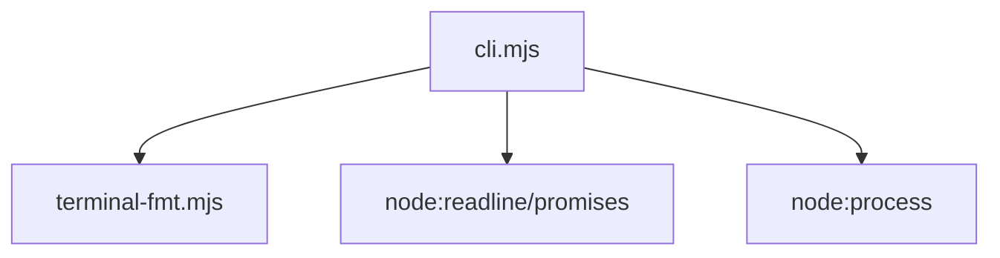

# cli.mjs 模块详细文档

## 目录

1. [文件概述](#文件概述)
2. [导出函数说明](#导出函数说明)
3. [内部函数说明](#内部函数说明)
4. [依赖关系](#依赖关系)
5. [使用示例](#使用示例)
6. [/read 命令详解](#read-命令详解)

---

## 文件概述

`cli.mjs` 是 agents-node 项目的命令行交互界面（REPL）模块，负责：

- 读取用户输入
- 运行 Agent 循环（`agentLoop`）
- 打印助手回复（自动检测并美化 JSON 输出）
- 提供 `/read` 命令控制文件显示模式

### 核心功能

| 功能 | 说明 |
|------|------|
| 交互式 REPL | 基于 Node.js `readline/promises` 实现 |
| Banner 展示 | 显示当前模式、工具集、工作区、模型等信息 |
| 智能输出 | 自动检测 JSON 并格式化输出 |
| 文件显示控制 | 通过 `/read` 命令切换折叠/展开/分页模式 |

---

## 导出函数说明

### 1. `printAssistantText(content)`

**功能**：打印助手的文本回复，自动检测并美化 JSON 内容。

**参数**：

| 参数 | 类型 | 说明 |
|------|------|------|
| `content` | `Array` | 内容块数组，每个块包含 `type` 和 `text` 属性 |

**处理逻辑**：

1. 遍历内容数组
2. 检测文本是否像 JSON（以 `{` 或 `[` 开头和结尾）
3. 如果是有效 JSON，调用 `prettifyIfJson()` 格式化并限制 48 行显示
4. 否则直接输出原始文本

**示例输出**：

```javascript
printAssistantText([
  { type: "text", text: '{"name": "test", "value": 123}' }
]);
// 输出格式化的 JSON
```

---

### 2. `runRepl(options)`

**功能**：启动交互式 REPL 会话。

**参数**：

| 参数 | 类型 | 说明 |
|------|------|------|
| `options.agentLoop` | `Function` | Agent 循环函数，接收历史记录数组 |
| `options.minimal` | `boolean` | 是否为精简模式（仅 bash 工具） |
| `options.repoRoot` | `string` | 工作区根目录路径 |
| `options.model` | `string` | 当前使用的 AI 模型名称 |

**返回值**：`Promise<void>`

**会话流程**：

```
1. 打印 Banner
2. 创建 readline 接口
3. 循环：
   ├─ 显示提示符 › 
   ├─ 读取用户输入
   ├─ 检查退出命令 (q/exit/Ctrl+C)
   ├─ 处理 /read 命令
   ├─ 添加到历史记录
   ├─ 调用 agentLoop
   └─ 打印助手回复
4. 关闭 readline 接口
```

**支持的命令**：

| 命令 | 说明 |
|------|------|
| `q`, `exit`, `Ctrl+C` | 退出 REPL |
| `/read <subcommand>` | 控制文件显示模式 |

---

## 内部函数说明

### `printBanner(options)`

**功能**：在 REPL 启动时打印装饰性 Banner。

**显示信息**：

- **模式**：`shell-only`（精简）或 `full`（完整）
- **可用工具**：根据模式显示不同工具集
- **工作区**：当前仓库根目录
- **模型**：当前使用的 AI 模型（如果提供）
- **退出方式**：`q` · `exit` · `Ctrl+C`
- **read_file 控制**：`/read` 命令提示

**Banner 样式**：

```
╭────────────────────────────────────────╮
│  agents-node · full                    │
│  tools: files · bash · todo · task ·   │
│  workspace /path/to/repo               │
│  model   gpt-4                         │
│  quit    q · exit · Ctrl+C             │
│  read_file  /read 折叠·全文·分页       │
╰────────────────────────────────────────╯
```

---

## 依赖关系

### 直接依赖



### 从 terminal-fmt.mjs 导入

| 导入项 | 类型 | 用途 |
|--------|------|------|
| `ansi` | Object | ANSI 颜色代码（cyan, dim, reset 等） |
| `prettifyIfJson` | Function | JSON 格式化 |
| `formatToolLogPreview` | Function | 工具输出框线格式化 |
| `stripAnsi` | Function | 去除 ANSI 转义序列 |
| `READ_FILE_UI_HELP` | String | `/read` 命令帮助文本 |
| `setReadFileDisplayMode` | Function | 设置文件显示模式 |
| `describeReadFileDisplayMode` | Function | 获取当前显示模式描述 |

### terminal-fmt.mjs 详细说明

`terminal-fmt.mjs` 是终端格式化工具模块，提供以下功能：

#### 1. ANSI 颜色常量

```javascript
ansi = {
  reset: "\x1b[0m",
  dim: "\x1b[2m",
  bold: "\x1b[1m",
  cyan: "\x1b[36m",
  gray: "\x1b[90m",
  yellow: "\x1b[33m",
  magenta: "\x1b[35m",
  green: "\x1b[32m",
}
```

#### 2. 文件显示模式控制

| 模式 | 说明 | 环境变量 |
|------|------|----------|
| `collapsed` | 折叠预览，只显示前 N 行 | `AGENT_READ_UI=collapsed` |
| `expanded` | 终端全文显示 | `AGENT_READ_UI=expanded` |
| `pager` | 使用系统分页器（less） | `AGENT_READ_UI=pager` |

#### 3. 相关环境变量

| 变量 | 默认值 | 说明 |
|------|--------|------|
| `AGENT_READ_UI` | `collapsed` | 默认显示模式 |
| `AGENT_READ_PREVIEW_LINES` | `18` | 折叠模式预览行数 |
| `AGENT_READ_MAX_CHARS` | `120000` | 最大读取字符数 |
| `AGENT_READ_MD` | - | Markdown 渲染控制（0/1） |
| `PAGER` | `less` | 分页器命令 |

#### 4. 核心函数

| 函数 | 功能 |
|------|------|
| `formatReadFileDisplay()` | read_file 专用格式化（折叠/展开/分页 + Markdown 渲染） |
| `formatToolLogPreview()` | 通用工具输出格式化 |
| `formatBashLog()` | Bash 命令输出格式化 |
| `boxAnsiContent()` | 带框线的内容展示 |
| `renderMarkdownTerminal()` | Markdown 终端渲染 |
| `prettifyIfJson()` | JSON 检测与美化 |

---

## 使用示例

### 基本用法

```javascript
import { runRepl } from "./cli.mjs";

async function agentLoop(history) {
  // 处理历史记录，调用 AI 模型
  // 将助手回复添加到 history
  const response = await callAIModel(history);
  history.push({ role: "assistant", content: response });
}

await runRepl({
  agentLoop,
  minimal: false,
  repoRoot: "/path/to/project",
  model: "gpt-4"
});
```

### 精简模式（仅 bash 工具）

```javascript
await runRepl({
  agentLoop,
  minimal: true,  // 显示 "shell-only" 模式
  repoRoot: "/path/to/project"
});
```

### 打印助手回复

```javascript
import { printAssistantText } from "./cli.mjs";

const content = [
  { type: "text", text: '{"status": "success", "data": [1, 2, 3]}' }
];

printAssistantText(content);
// 输出格式化的 JSON，带框线
```

---

## /read 命令详解

### 命令格式

```
/read [subcommand]
```

### 子命令列表

| 子命令 | 别名 | 功能 |
|--------|------|------|
| `help` | `?` | 显示帮助信息 |
| `collapse` | `collapsed`, `close` | 切换到折叠模式 |
| `expand` | `expanded`, `open`, `full` | 切换到展开模式 |
| `pager` | - | 切换到分页模式 |
| `reset` | - | 重置为环境变量设置 |
| `status` | - | 显示当前模式 |

### 使用示例

```bash
# 显示帮助
/read help
/read ?

# 切换到折叠模式（默认）
/read collapse
# 输出: read_file UI → 折叠预览

# 切换到展开模式
/read expand
# 输出: read_file UI → 终端全文

# 切换到分页模式
/read pager
# 输出: read_file UI → 分页器（less -R）

# 查看当前模式
/read status
# 输出: 折叠预览（环境变量 AGENT_READ_UI）

# 重置为环境变量
/read reset
# 输出: read_file UI → 已恢复环境变量
```

### 模式优先级

```
会话覆盖（/read 命令设置） > 环境变量 AGENT_READ_UI > 默认值（collapsed）
```

### 各模式行为

#### 折叠模式（collapsed）

- 文件内容超过预览行数时，只显示前 N 行（默认 18 行）
- 显示提示：`… 已折叠：还剩 X 行 · /read expand 展开 · /read pager 分页`
- 适用于快速浏览大文件

#### 展开模式（expanded）

- 在终端中显示完整文件内容
- 仍受 `AGENT_READ_MAX_CHARS` 限制（默认 120000 字符）
- 适用于需要查看完整内容的场景

#### 分页模式（pager）

- 将内容写入临时文件
- 使用系统分页器（默认 `less -R`）打开
- 临时文件位置：`{repoRoot}/.agent-cache/last-read-view.txt`
- 适用于查看超大文件

### 环境变量配置

```bash
# 设置默认显示模式
export AGENT_READ_UI=expanded

# 设置折叠模式预览行数
export AGENT_READ_PREVIEW_LINES=30

# 设置最大读取字符数
export AGENT_READ_MAX_CHARS=200000

# 禁用 Markdown 渲染
export AGENT_READ_MD=0

# 强制启用 Markdown 渲染
export AGENT_READ_MD=1

# 自定义分页器
export PAGER="less -R -N"
```

---

## 架构图

```
┌─────────────────────────────────────────────────────────┐
│                        cli.mjs                          │
├─────────────────────────────────────────────────────────┤
│  ┌─────────────┐  ┌─────────────┐  ┌─────────────────┐ │
│  │ printBanner │  │printAssistant│  │    runRepl      │ │
│  │   (内部)    │  │    Text     │  │   (主入口)      │ │
│  └─────────────┘  └─────────────┘  └─────────────────┘ │
│         │                │                  │           │
│         └────────────────┴──────────────────┘           │
│                          │                              │
│                          ▼                              │
│              ┌─────────────────────┐                    │
│              │  terminal-fmt.mjs   │                    │
│              │  (格式化工具模块)    │                    │
│              └─────────────────────┘                    │
│                          │                              │
│         ┌────────────────┼────────────────┐             │
│         ▼                ▼                ▼             │
│    ┌─────────┐     ┌──────────┐    ┌──────────┐        │
│    │  ansi   │     │ prettify │    │  format  │        │
│    │ 颜色代码│     │ IfJson   │    │ 各种输出 │        │
│    └─────────┘     └──────────┘    └──────────┘        │
└─────────────────────────────────────────────────────────┘
```

---

## 注意事项

1. **分页器依赖**：`pager` 模式需要正确设置 `repoRoot`，否则会自动降级为 `expanded` 模式
2. **字符限制**：所有模式都受 `AGENT_READ_MAX_CHARS` 限制，超大文件会被截断
3. **Markdown 检测**：自动检测 `.md`、`.mdx`、`.markdown` 文件以及内容中的 Markdown 特征
4. **历史记录**：`runRepl` 维护完整的对话历史，传递给 `agentLoop` 函数
5. **信号处理**：支持 `Ctrl+C` 优雅退出

---

*文档生成时间：基于 cli.mjs 和 terminal-fmt.mjs 代码分析*
